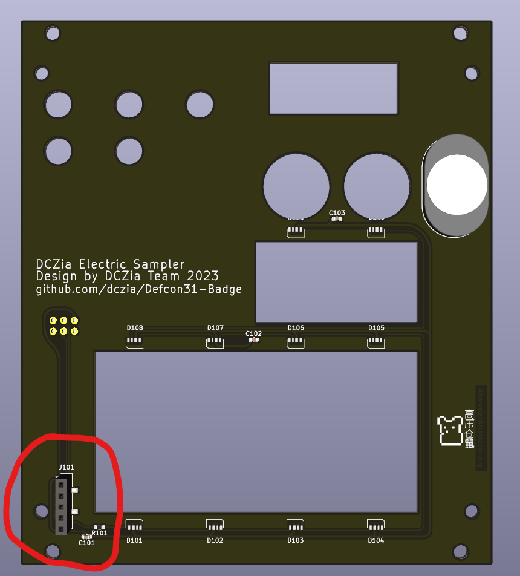
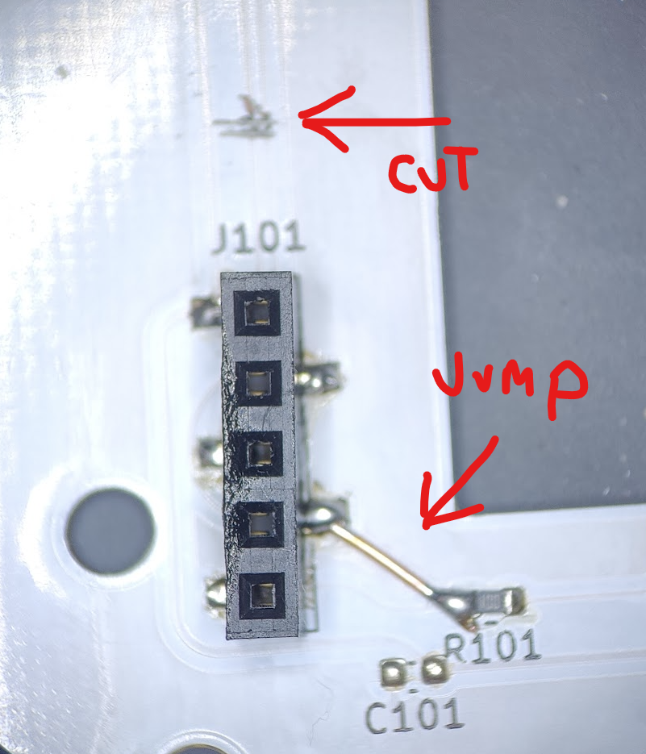
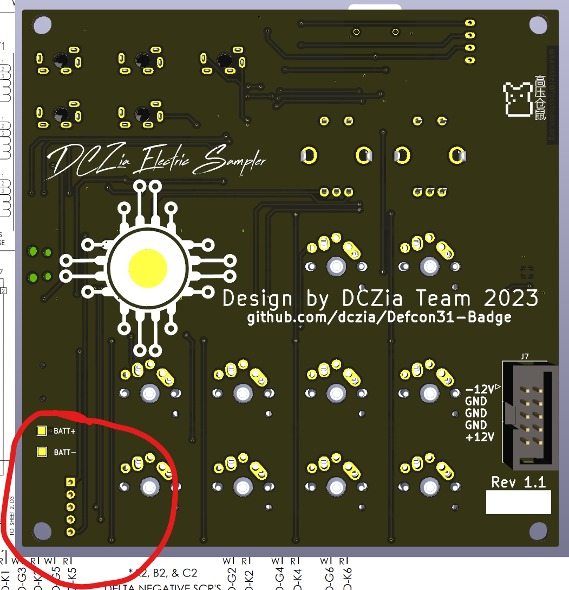
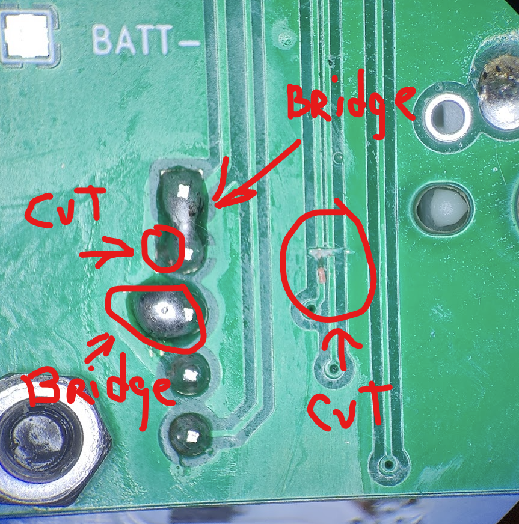

### Bodges required for 1.0 LED board

These bodges are required in order for a version 1.0 LED board (no version note on the board) to work with a 1.0 or 1.1 back board.  If you have a later version of the LED board, you will not need these changes and you will have to revert your backboard.

### The Issue

When designing the board to board connector, originally a 4 pin connector was used.  The master layout was created, and then forked into the front board and the back board.  Later, there was a desire to bring SDA/SCL to the front board for the SAO connector, so the board-to-board was updated to be a 5 pin.

However, on the front board the new pin was added to the bottom, and on the back board the new pin was added to the top, leaving us with a off-by-one error

### The Fix

To fix this, we will sever the I2C SDA/SCL lines, and move the power lines slightly.  You will need a sharp knife to cut the traces and also to remove some solder mask, some rosin flux solder, and a short piece of wire.

Start with the front board.  Locate the board to board connector at the lower left of the board.

1. Take your knife and sever the two I2C lines above the connector.  These are the thin ones to the right - ***DO NOT*** cut the thicker line to the left.  
2. Take a short piece of wire, and jumper pin 4 of the connector to the left terminal of R101.

Now we will move the back board.  Flip the board over to see the back side.  Locate the 5 pin connector in the lower left of the board.

At this location, you will need to perform several actions.

1. Using solder, bridge the top two pins together.  Heat both, apply solder, and continue applying solder while pulling the iron away.
2. The second pin here is connected to the ground plane via a single trace.  Sever this trace.
3. At pin 3, scrape some of the solder mask off the ground plane next to it.  Using your solder, tin the exposed copper, and then using the technique from (1) bridge the ground plane with pin 3.
4. Locate the I2C lines to the right of the connector.  These are the small lines that both go into vias at the bottom.  Sever these lines with your knife.

At this point, the LEDs will now work.